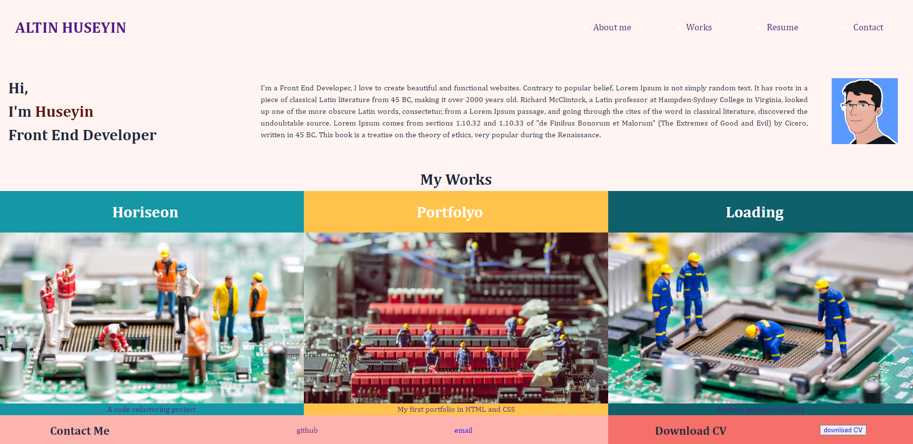
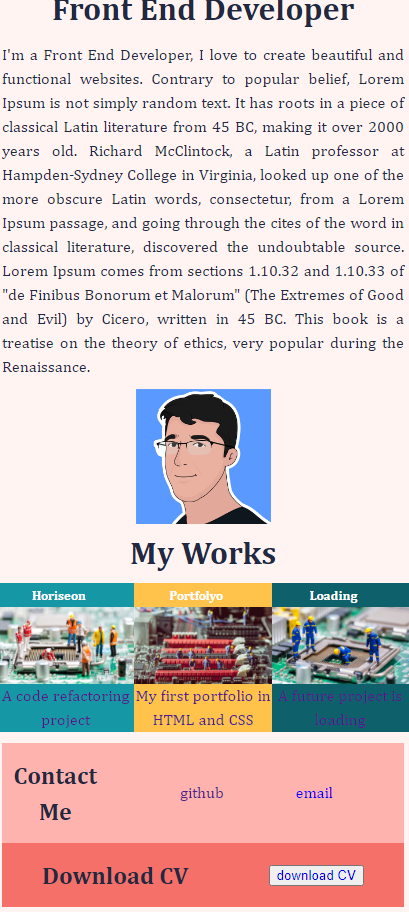

## introduction
Welcome to my portfolio project! This is a showcase of my work and skills as an aspiring web developer. I've put together a collection of my projects to give you a glimpse of what I can do.

## project Title
**My Portfolio**

## motivation
I created this portfolio because I wanted a place where I could display the websites and applications I've built.

## screenshots

## links
- Link to the code website <a href="https://6nhuseyin.github.io/...." target="_blank"> link to the code website</a>
- Link to the code repository <a href="https://github.com/6nhuseyin" target="_blank"> link to the code repository</a>

## usage
- Just visit [my portfolio website](https://www.myportfolio.com) in your web browser.
- Click on the project images to view more details about each project.
- Read the "About Me" section to learn about my background and interests.

## features
- **Project Gallery**: You can see a gallery of my projects with descriptions and links.
- **About Me**: Get to know me a bit better through the "About Me" section.
- **Contact**: Reach out to me through the contact form.
- **Responsive Design**: The portfolio looks great on both big computer screens and small phone screens.

## conclusion
I hope you enjoy exploring my portfolio as much as I enjoyed creating it. It's a starting point of my journey as a web developer, and I look forward to what the future holds.

## credits
Front-end web developer: Huseyin Altin
<a href="https://github.com/6nhuseyin" target="_blank">GitHub</a>
- I'd like to thank my coding bootcamp instructors for teaching me these skills.

## technologies used
- HTML
- CSS

# change log

- [x] **download and unzip starter code**

  - [x] download the provided starter code.
  - [x] unzip it to a local directory.

- [ ] **set up environment: create and clone github repository**

  - [x] install a code editor (e.g., visual studio code).
  - [x] create a new github repository with a unique name.
  - [x] clone the repository to your local machine.

- [x] **add starter code to repository**

  - [x] add the unzipped starter code to your local repository.
  - [x] push the initial code to github.

- [x] **understand requirements and plan**

  - [x] review acceptance criteria and grading requirements.
  - [x] create a wireframe of your portfolio.
  - [x] define color scheme, fonts, and images.

- [ ] **html structure**

  - [x] create the basic html structure for your portfolio, including navigation links.
  - [x] include your name, a recent photo or avatar, and links to sections about you, your work, and how to contact you.

- [x] **check accessibility and semantic html**

  - [x] verify accessibility features.
  - [x] implement semantic elements consistently.
  - [x] organize html elements logically.

- [x] **fix background image**

  - [x] correct the path of the background image.
  - [x] ensure it fits the screen.
  - [x] provide descriptive alt text for all image and icon elements.
  - [x] review and adjust heading order for logical hierarchy.

- [x] **about section**

  - [x] write and add content to the "about me" section.
  - [x] style the section for visual appeal.
  - [x] **agile review:** assess content alignment with goals.

- [ ] **work/projects section**

  - [x] create placeholders for work/projects.
  - [x] implement titled images for projects.
  - [x] style these elements.
  - [x] ensure clicking application images leads to deployed applications.
  - [x] **agile review:** review and refine work/projects section.

- [x] **css setup**

  - [x] set up css files and apply basic styling to your html structure.
  - [x] optimize those styles for visual impact.
  - [x] **agile review:** review and improve initial css styles.

- [x] **responsive design**

  - [x] begin implementing responsive design using media queries.
  - [x] focus on desktop screen layout.
  - [x] **agile review:** assess css for responsive design and refine as needed.

- [x] **consolidate and organize css**

  - [x] refactor css selectors and properties for efficiency.
  - [x] organize css to match html structure.
  - [x] consolidate, group, and remove redundant styles.
  - [x] improve code readability.

- [x] **add comments**

  - [x] include comments in html to explain structure.
  - [x] comment css to describe sections and styling rules.

- [ ] **larger image for first application**

  - [ ] implement larger image for the first project.
  - [ ] ensure the first application's image is larger than others.
  - [x] **agile review:** review visual impact and functionality.

- [x] **testing**

  - [x] update the file structure and paths.
  - [x] test on various devices and browsers for compatibility.
  - [x] check that all application links function correctly.

- [x] **documentation and submission**

  - [x] create a detailed readme.md file in your repository.
  - [x] include project description, screenshots, links, and code source information.
  - [x] double-check acceptance criteria.
  - [x] submit urls of deployed application and github repository.

- [ ] **application quality checklist**

  - [x] when the page is loaded, the page presents your name, a recent photo or avatar, and links to sections about you, your work, and how to contact you.
  - [x] when one of the links in the navigation is clicked, then the ui scrolls to the corresponding section.
  - [x] when viewing the section about your work, then the section contains titled images of your applications.
  - [ ] when presented with your first application, then that application's image should be larger in size than the others.
  - [x] when images of the applications are clicked, then the user is taken to that deployed application.
  - [x] when the page is resized or viewed on various screens and devices, then the layout is responsive and adapts to my viewport.

- [ ] **deployment**

  - [ ] host your portfolio on github pages or another platform.
  - [ ] navigate to your github repository in the browser and then select the settings tab on the right side of the page.
  - [ ] on the settings page, scroll down to the github pages section. then, in the section labeled source, select the main branch as your source.
  - [ ] deploy the application using github pages.
  - [ ] ensure no load errors and that the application is accessible via the live url.
  - [ ] navigate to `<your-github-username.github.io/your-repository-name>` and you will find that your new webpage has gone live! for example, if your github username is "lernantino" and the project is "css-demo-site", then your url would be `lernantino.github.io/css-demo-site`.

